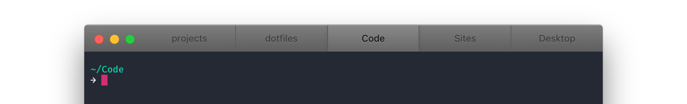

# hyper-mac-pro

[](https://travis-ci.org/kremalicious/hyper-mac-pro)
[](https://greenkeeper.io/)

> Cause you deserve native & pro. Tab style for [Hyper](https://hyper.is/) inspired by Apple's pro apps on macOS.



This has only been tested on macOS and is not guaranteed to work on other operating systems.

## Installation

Install by adding `hyper-mac-pro` to the `plugins` property in your `~/.hyper.js`:

```js
plugins: [
  'hyper-mac-pro'
]
```

If you're using [hpm](https://github.com/zeit/hpm), from the command line:

```bash
hpm install hyper-mac-pro
```

## Contribute

1. [Fork](https://help.github.com/articles/fork-a-repo/) this repository to your own GitHub account and then [clone](https://help.github.com/articles/cloning-a-repository/) it to your local device (make sure that it's located in `~/.hyper-plugins/local`)
2. Add `hyper-mac-pro` to the `localPlugins` property within `~/.hyper.js`
3. Restart Hyper

Install dependencies with `npm install` and hack away. Run the tests using `npm test`. Running tests will happen automatically before every commit.

## Author

- Matthias Kretschmann ([@kremalicious](https://twitter.com/kremalicious))
